## 
ОТЧЕТ
 
по домашним заданиям к занятию «Teamcity»

## 
Выполнил: студент Порсев И.С.

## Подготовка к выполнению

1. В Yandex Cloud создайте новый инстанс (4CPU4RAM) на основе образа `jetbrains/teamcity-server`.
2. Дождитесь запуска teamcity, выполните первоначальную настройку.
3. Создайте ещё один инстанс (2CPU4RAM) на основе образа `jetbrains/teamcity-agent`. Пропишите к нему переменную окружения `SERVER_URL: "http://<teamcity_url>:8111"`.

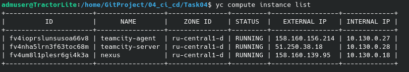  

4. Авторизуйте агент.

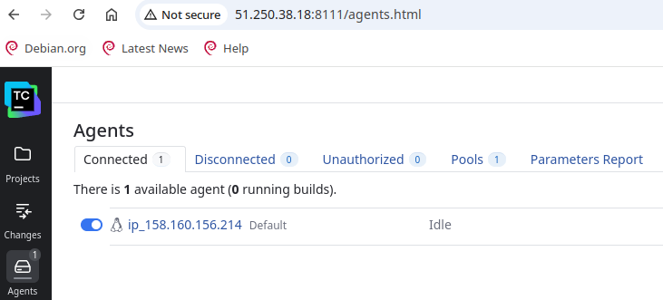  

5. Сделайте fork [репозитория](https://github.com/aragastmatb/example-teamcity).
6. Создайте VM (2CPU4RAM) и запустите [playbook](./infrastructure).

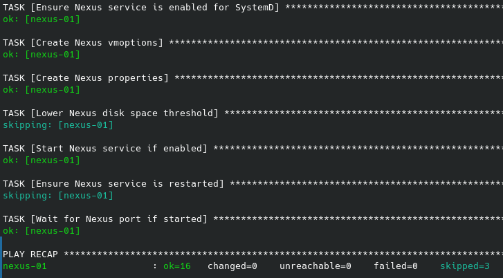  

## Основная часть

1. Создан новый проект в teamcity на основе fork.

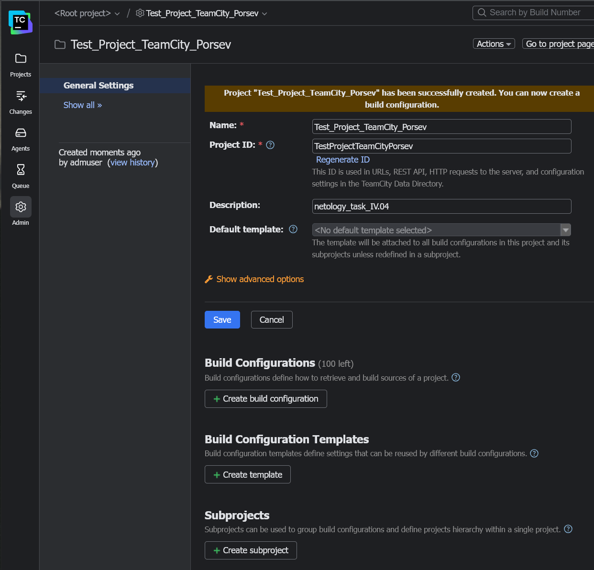

2. Сделан autodetect конфигурации.

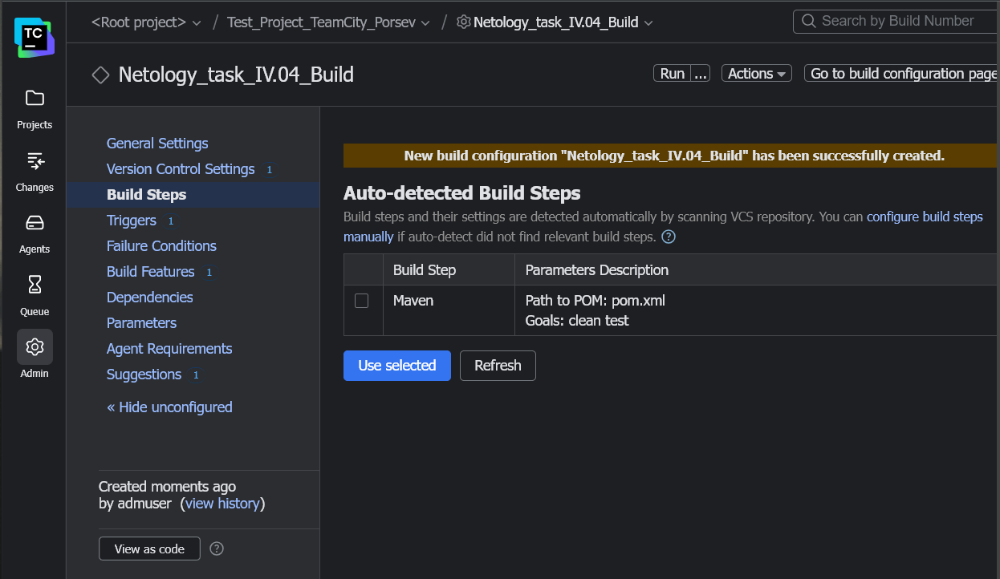

3. Сделаны необходимые шаги, была запущена первая сборка main.

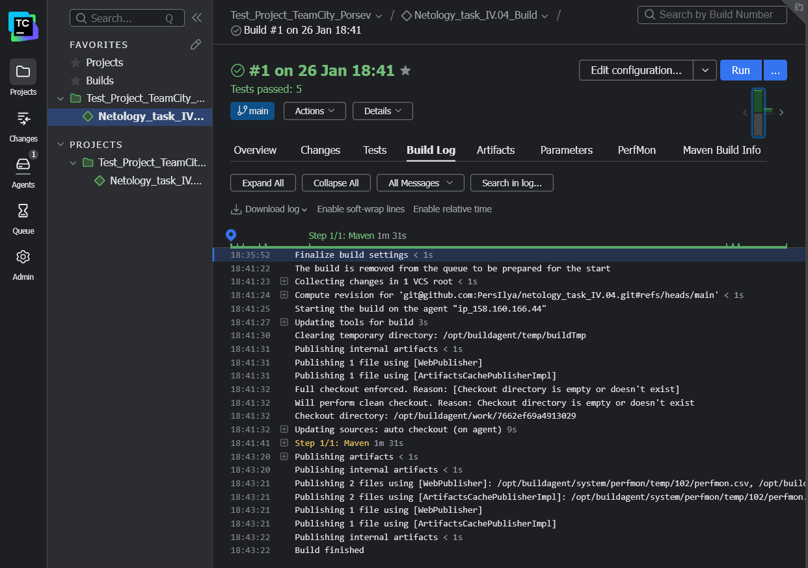

4. Поменяны условия сборки: если сборка по ветке `main`, то должен выполняться `mvn clean deploy`, иначе `mvn clean test`.

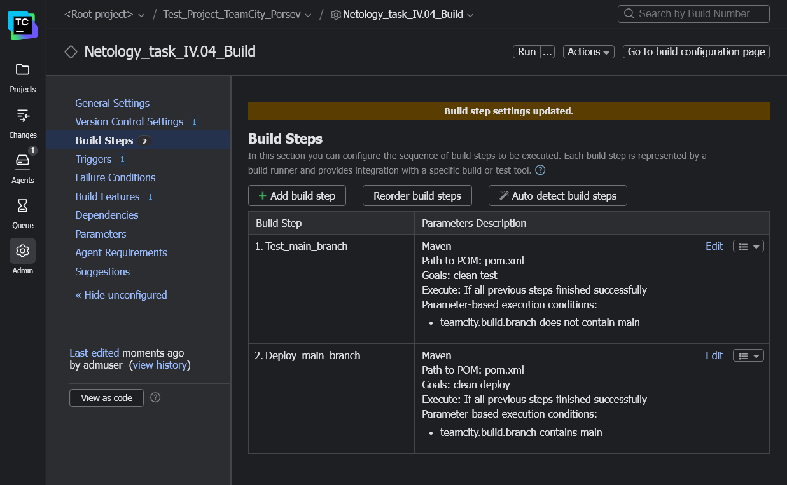

5. Для deploy был загружен файл [settings.xml](./teamcity/settings.xml) в набор конфигураций maven у teamcity, предварительно записав туда креды для подключения к nexus.

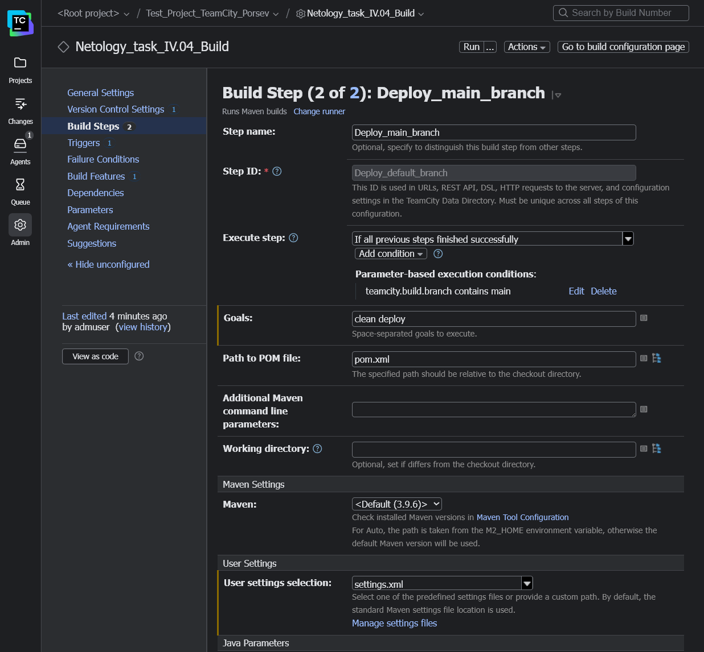

6. В файле pom.xml были изменены ссылки на Sonatype Nexus Repository.

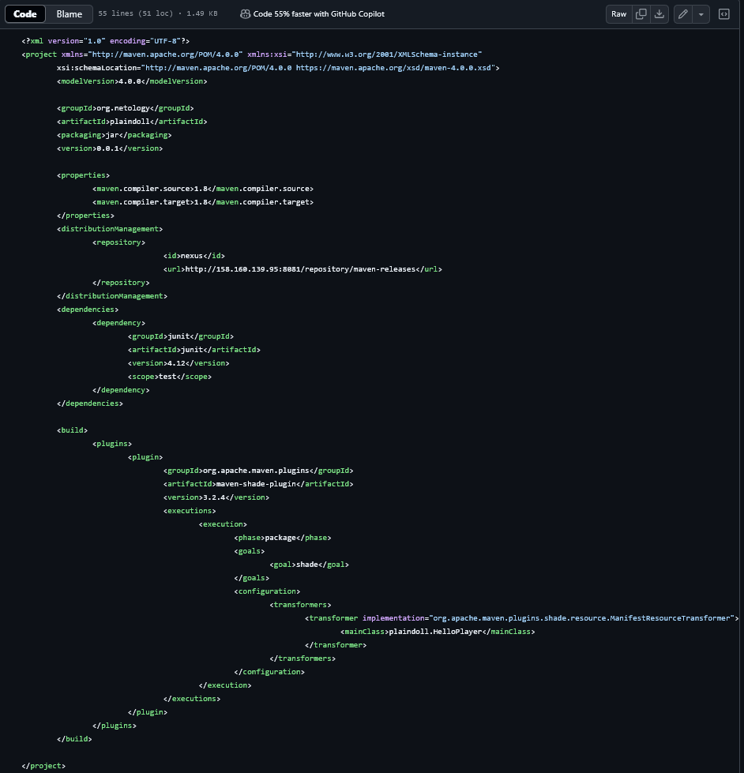

7. Была запущена сборка ветки  main. Сборка прошла успешно, собранные артефакты были загружены в Sonatype Nexus Repository.

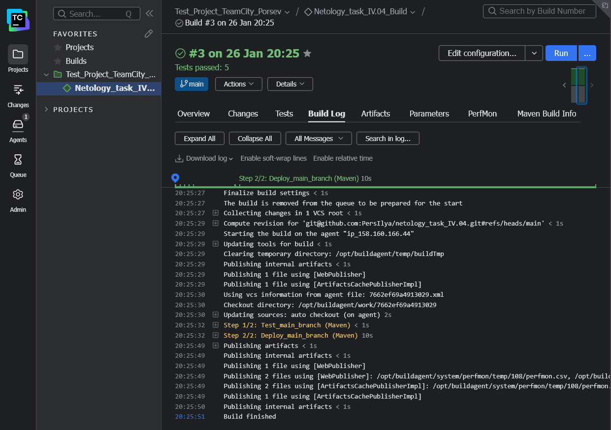
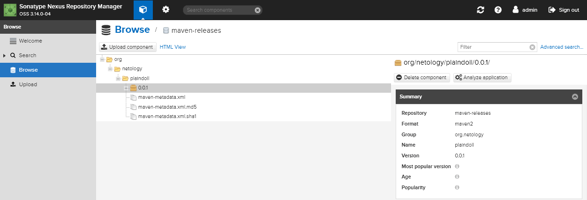

8. Миграция `build configuration` в репозиторий.

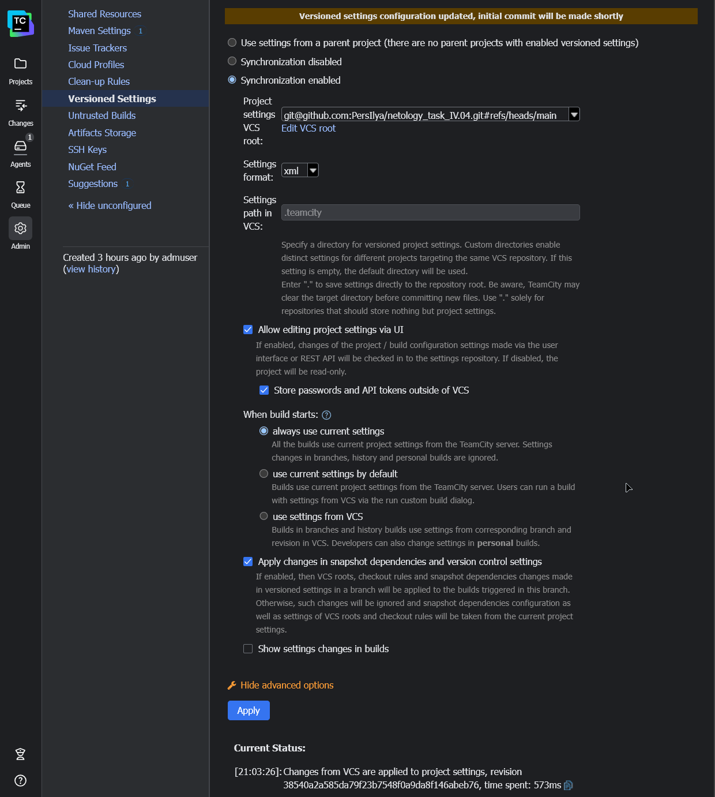

9. Создание отдельной ветки `feature/add_reply` в репозитории.

> **Switched to a new branch "feature/add_reply"**

10. Напишите новый метод для класса Welcomer: метод должен возвращать произвольную реплику, содержащую слово `hunter`.
11. Дополните тест для нового метода на поиск слова `hunter` в новой реплике.
12. Сделайте push всех изменений в новую ветку репозитория.
13. Убедитесь, что сборка самостоятельно запустилась, тесты прошли успешно.
14. Внесите изменения из произвольной ветки `feature/add_reply` в `master` через `Merge`.
15. Убедитесь, что нет собранного артефакта в сборке по ветке `master`.
16. Настройте конфигурацию так, чтобы она собирала `.jar` в артефакты сборки.
17. Проведите повторную сборку мастера, убедитесь, что сбора прошла успешно и артефакты собраны.
18. Проверьте, что конфигурация в репозитории содержит все настройки конфигурации из teamcity.
19. В ответе пришлите ссылку на репозиторий.

---

### Как оформить решение задания

Выполненное домашнее задание пришлите в виде ссылки на .md-файл в вашем репозитории.

---
